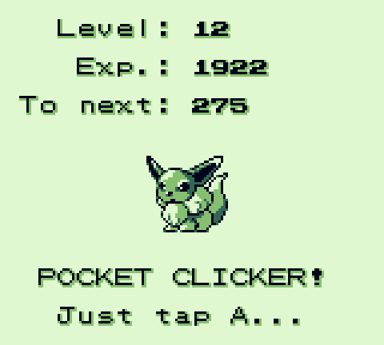

# Pocket Clicker

A Cookie Clicker clone for the Game Boy written in Nim! (plus my own `crt0` and basic routines in ASM)

Unlike my [last proof-of-concept](https://github.com/ZoomTen/nim-gb-test), this time I try not to depend too much on GBDK (particularly the GB-specific part), but rather to try and compile everything from the C that Nim generates.



(Pokémon-theme hopefully temporary)

## How to build

For best results, do this in a Unix-like environment.

### Requirements

* [Nim](https://nim-lang.org/) ≥ 2.0.0
* [GBDK 2020](https://gbdk-2020.github.io/gbdk-2020/)

### Steps

1. Ensure the `GBDK_ROOT` environment variable points to your GBDK 2020 installation folder.
2. Clone the repo:
```
git clone https://github.com/ZoomTen/pocket-clicker
```
3. `cd` into the repo folder and run:
```
nim build
```
4. To clean up the repo folder of generated files including the ROM:
```
nim clean
```
5. To clean up the repo folder **excluding** the ROM and debug symbols:
```
nim cleanDist
```
